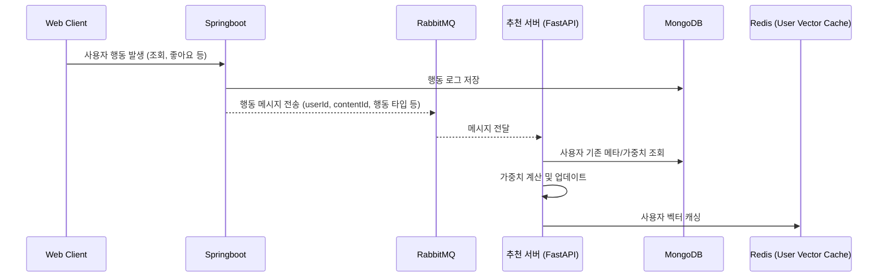
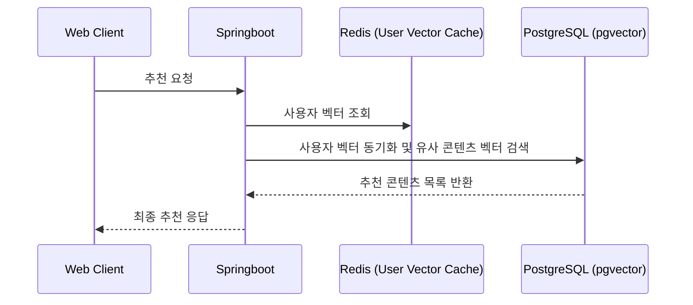
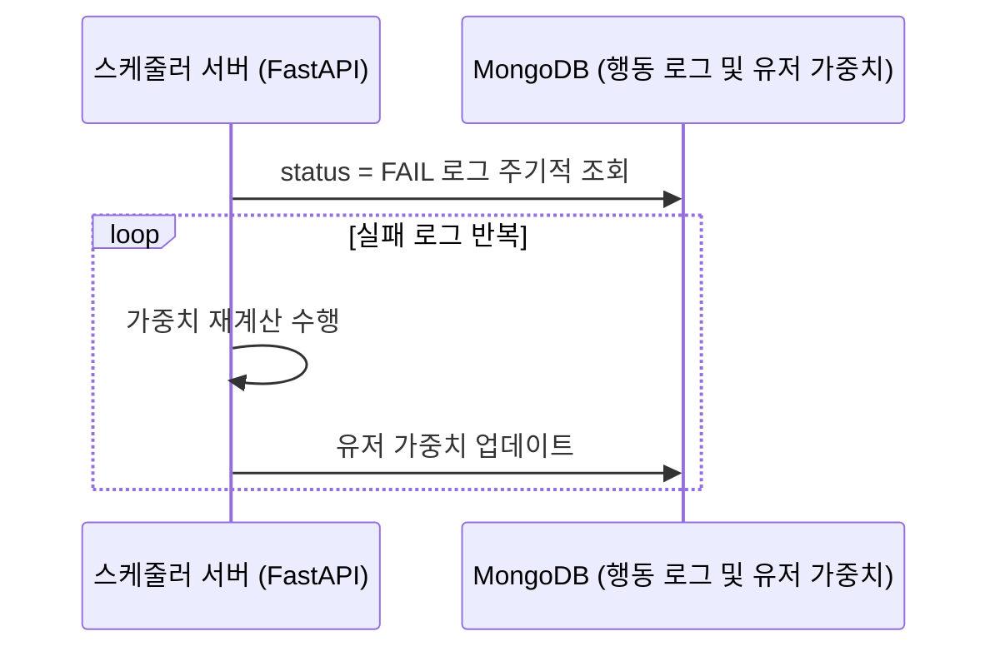
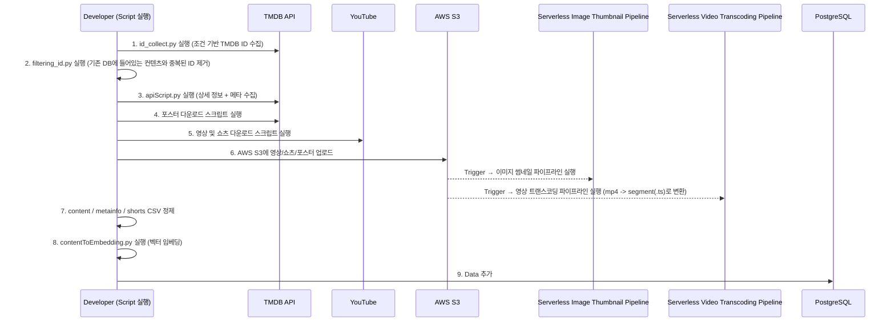

# LEAD:ME

## 🚩 프로젝트 소개

OTT 서비스 사용자들은 자신의 취향에 맞는 콘텐츠를 찾기 어렵다는 문제를 자주 경험합니다.  
LEAD:ME는 사용자의 명시적 입력 없이 **행동 데이터만으로** 개인화된 콘텐츠를 추천하는 백엔드 시스템을 설계하고 구축했습니다.

<br/>

## 🎯 개발 목표

- 사용자 행동 데이터를 실시간으로 반영하는 백엔드 시스템을 구축합니다.
- **인프라 사용 비용을 최소화**하면서도, **최소 사양 환경에서도 안정적으로 운영 가능한** 백엔드 아키텍처를 구성합니다.
- 장애나 예외 상황에서도 사용자 행동 데이터가 안전하게 수집·저장되도록 아키텍처를 설계합니다.

<br/>
<br/>

## 🏛️ 시스템 아키텍처 설계 과정

### 초기 버전의 한계점 파악


초기 설계에서는 다음과 같은 한계점들이 발견되었습니다:

- API 서버와 추천 로직이 하나의 서버에 집중되어 트래픽 증가 시 병목이 발생할 수 있습니다.
- 사용자 행동 데이터를 실시간으로 반영하므로 RDB에 과도한 부하가 발생합니다.
- MySQL은 벡터 연산에 최적화되지 않아, 유사도 검사를 반복할 경우 성능 저하가 발생합니다.
- 장애 발생 시 사용자 행동 데이터가 유실될 가능성이 존재합니다.

<br/>

### 최종 아키텍처 - 문제점 해결


위 한계점들을 해결하기 위해 다음과 같이 아키텍처를 개선했습니다:

> ### 🚀 핵심 개선 사항
>
> #### **🔸서버 분리**
>
> API 서버(Spring Boot)와 추천 로직 서버(FastAPI)를 분리하여 **역할과 책임을 명확히 분리**했습니다.
>
> #### **🔸데이터베이스 최적화**
>
> MongoDB와 Redis를 함께 사용하여 **RDB의 부하를 줄이고, 데이터 접근 속도를 향상**시켰습니다.
>
> #### **🔸장애 복구 시스템**
>
> 장애 발생 시에도 사용자 행동 로그가 유실되지 않도록, **로그 기반 상태 관리 및 복구 메커니즘을 도입**했습니다.
>
> #### **🔸벡터 연산 최적화**
>
> PostgreSQL(pgvector)로 전환하여, **유사도 기반 검색의 효율을 높였습니다**.

<br/>

## 📊 아키텍처 개선으로 인한 성능 비교

### 테스트 환경

- 가상 사용자 수: 100명
- 총 요청 수: 1,000회

<br/>

### 1️⃣ 행동 기반 가중치 업데이트 성능

```
사용자 행동 → 컨텐츠 메타 정보 조회 → 사용자 가중치 업데이트 → 사용자 벡터 재계산
```

| 서버 구조 | 평균 응답 속도 | 개선 효과      |
| --------- | -------------- | -------------- |
| 초기 버전 | 2.24s          | -              |
| 최종 버전 | 743.71ms       | **3.2배 단축** |

<br/>

**📍초기 버전**  


**📍최종 버전**  


<br/>

### 2️⃣ 실시간 동기 처리 성능

```
사용자 행동 → DB에 가중치, 벡터값 업데이트
```

| 서버 구조 | 실시간 DB I/O | 평균 응답 시간 | 개선 효과       |
| --------- | ------------- | -------------- | --------------- |
| 초기 버전 | 200~250번     | 2.7s           | -               |
| 최종 버전 | 0번           | 1.54s          | **1.16초 단축** |

최종 버전에서는 벡터 값을 Redis에 먼저 저장하고, 필요 시에만 PostgreSQL과 동기화하여 DB I/O를 대폭 줄였습니다.

<br/>

**📍초기 버전**  


**📍최종 버전**  


<br/>

### 3️⃣ 데이터베이스 분산 효과

데이터베이스 역할 분리로 안정적인 성능을 확보했습니다:

- **MongoDB**: 사용자 행동 로그 저장, 실패 로그 관리 (CPU 사용률 40%)
- **PostgreSQL**: 사용자 벡터 저장 및 유사도 연산 (CPU 사용률 10% 미만)

<br/>

**MongoDB CPU 사용률**


<br/>

**PostgreSQL CPU 사용률**


<br/>
<br/>

## 📋 시스템 동작 플로우


### 💠 사용자 행동 처리 플로우



```
1. MongoDB에 사용자 행동 로그를 저장합니다.
   - 행동 정보(조회, 좋아요 등)를 이벤트 발생 시마다 기록합니다.

2. 웹 서버(Spring)에서 사용자 행동에 대한 가중치 업데이트 이벤트를 RabbitMQ로 메시지를 보냅니다.
   - 메시지에는 사용자 ID, 컨텐츠 ID, 행동 타입, 컨텐츠 메타 정보, 상태값 등이 포함됩니다.

3. 추천 서버(FastAPI)가 RabbitMQ로부터 가중치 업데이트 이벤트 메시지를 전달받습니다.

4. 추천 서버에서 사용자의 선호 메타 정보, 가중치를 조회합니다.

5. 조회된 정보와 전달받은 행동 로그 메시지를 통해 사용자의 기존 가중치를 업데이트 합니다.
   - 예시) 사용자가 '스릴러' 콘텐츠를 시청하는 경우, '스릴러'에 대한 가중치가 증가합니다.

6. 갱신된 가중치를 기반으로 사용자 벡터를 계산후, 계산된 사용자 벡터를 Redis에 캐싱합니다.
```
<br/> 

### 💠 추천 처리 플로우



```
1. 웹 서버(Spring)에서 Redis에 캐싱된 사용자 벡터를 조회합니다.

2. 조회된 벡터를 PostgreSQL에 동기화하여 정합성을 유지합니다.

3. PostgreSQL에서 벡터 유사도 기반 쿼리를 통해 추천 콘텐츠를 계산합니다.

4. 최종 추천 콘텐츠 목록을 사용자에게 응답으로 전달합니다.
```
<br/> 

### 💠 장애 복구 플로우



```
1. 스케줄러 서버(FastAPI)는 1분 간격으로 사용자 행동 로그 중 status = FAIL로 기록된 항목을 조회합니다.
   - 행동 로그 처리 중 오류로 인해 가중치 반영에 실패한 경우, 로그는 `FAIL` 상태로 기록됩니다.
   - 스케줄러가 주기적으로 이 실패 로그를 조회하여, 정상적으로 가중치가 반영되지 않은 사용자의 상태를 복구합니다.

2. 조회된 실패 로그에 대해 가중치 업데이트 로직을 재실행하여, 누락되었던 사용자 가중치를 복구합니다.
```
<br/>
<br/>

## 🔧 핵심 기술 적용 사례

<br/>

### 🎬 도메인 특화 장르 임베딩 개발

**문제점**  
기존 임베딩 모델(Google Word2Vec)은 일반 문맥 기반으로 학습되어 영화 도메인에 적합하지 않았습니다. 실제로 유사한 장르인 Thriller와 Action조차 서로 전혀 다른 벡터로 표현되는 문제가 있었습니다.

**해결방안**  
영화-장르 간 관계를 그래프로 구성하고 이를 기반으로 학습한 도메인 특화 임베딩 모델(Node2Vec)을 새롭게 개발했습니다.


**성능 비교**
| Model | Precision | 모델 크기 | 개선 효과 |
|------------------|-----------|-----------|-----------|
| Google Word2Vec | 0.559 | 1.5 GB | - |
| Node2Vec | 0.718 | 2.7MB | **28% 정확도 향상, 99% 크기 절약** |

<br/>


### 🪄 스케줄러 기반 데이터 안정성 확보


#### ⭐️ 실패 로그 재처리 스케줄러 (1분 주기)

**목적**: 가중치 반영 실패로 유실된 데이터 자동 복구

**동작 흐름**

```
MongoDB에서 상태가 fail인 로그 조회 → 실패 로그의 가중치를 재계산 → 사용자 가중치 컬렉션(MongoDB)에 반영
```

#### ⭐️ 가중치 노후화 보정 스케줄러 (1일 주기)

**목적**: 시간이 지남에 따라 유효성이 낮아진 오래된 행동 로그 보정

**동작 흐름**

```
action log 조회 → 로그 기반으로 시간 가중 감쇠 함수 적용 → 감쇠된 값을 기반으로 벡터를 재계산 후 Redis에 저장
```

<br/>


### 🪄 효율적인 행동 로그 관리 전략


#### 📍 MongoDB 컬렉션 분리를 통한 처리 효율화

**문제점**  
초기에는 모든 사용자 행동 로그를 하나의 action_log 컬렉션에 저장하고, 실패 로그 재처리 시 전체 로그를 매번 필터링했습니다. 이는 행동 로그가 증가할수록 비효율적이었습니다.

**해결방안**  
실패한 로그만 별도로 managed_action_log 컬렉션에 저장하여, 재처리 시 해당 컬렉션만 조회하도록 구조를 분리했습니다.

<br/>

#### 📍 행동 로그 상태값 관리 시스템

사용자 행동 로그 유실을 방지하기 위해 3단계 상태값으로 관리합니다:

- **PROCESSING**: 행동 로그가 MongoDB에 저장되었지만, 아직 가중치 업데이트가 완료되지 않은 상태
- **SUCCESS**: 행동 로그의 가중치 업데이트 및 벡터 계산이 성공적으로 완료된 상태
- **FAIL**: 시스템 오류 또는 예외로 인해 처리에 실패한 상태로, 1분마다 실행되는 스케줄러에 의해 재시도

<br/>
<br/>

### 🍿 쇼츠 영상 추천 시스템


#### 📍 무한 스크롤 최적화

**전략**: 사용자의 빠른 소비 패턴을 고려한 캐싱 구조  
- 최초 요청 시 콘텐츠 30개를 캐싱해두고, 사용자가 모두 소비하면 다음 30개를 불러와 다시 캐싱하여 끊김 없는 경험을 제공합니다.
- 다시 불러오는 30개의 콘텐츠는 이전 30개와 겹치지 않도록 조회하여 UX를 향상시켰습니다.

#### 📍 개인화와 다양성의 균형

**문제 인식**: 높은 일치율의 콘텐츠만 노출되면 추천 편향 발생 가능

**해결 전략**: 추천 콘텐츠 30개 중

- 20개: 사용자 벡터와 유사도가 높은 개인화 콘텐츠
- 10개: 무작위 선택된 다양성 확보 콘텐츠

<br/>


### 🔧 MongoDB 동시성 문제 해결

<br/>

**문제 배경**  
사용자 가중치는 실시간 업데이트와 주기적 스케줄러에 의해 동시 수정되어 동시성 문제가 발생했습니다.

| 업데이트 주체    | 연산 방식 | 설명                                  |
| ---------------- | --------- | ------------------------------------- |
| 사용자 행동 기록 | $inc      | 실시간 가중치 증가                    |
| 1분 스케줄러     | $inc      | 실패한 로그 재처리로 가중치 증가      |
| 데일리 스케줄러  | $set      | 시간 감쇠 함수 적용 후 전체 값 재설정 |

<br/>

**테스트 시나리오**

```
1. k6를 통해 동일 콘텐츠에 대한 조회 요청 200개를 전송 (실시간 업데이트: $inc)
2. 요청과 동시에 Daily Weight Resizing 스케줄러를 수동 실행 (가중치 재설정: $set)
3. 정상 작동 시 user_weight 기대치: 약 20
```


**문제 발생 결과**  


<br/>

**해결 방안**  
> $set 연산을 $inc 연산으로 변경하여, 기존 값을 덮어쓰지 않고 변화량만 반영하도록 수정했습니다.

 <br/>

**해결 후 결과**  


- 동시성 문제가 해소되었고 모든 요청이 각자의 변화량만큼 정확히 반영됩니다

<br/>
<br/>

##

### 🪄 콘텐츠 데이터 수집 파이프라인 (From TMDB & YouTube)

TMDB와 YouTube 데이터를 활용한 반자동 콘텐츠 수집 및 정제 파이프라인을 소개합니다.<br/>
장르, 영상, 썸네일, 메타정보 등 다양한 요소를 수집하고 이를 RDB 테이블 및 벡터 임베딩에 맞게 자동으로 처리합니다.<br/>
수집된 데이터는 콘텐츠 제공에 활용됩니다.



<br/>

> AWS를 활용한 Serverless data pipleline은 아래와 같습니다. 


##


## 🏗️ 전체 시스템 아키텍처


<br/>
<br/>

## 🗃️ ERD


> [▶️ERD CLOUD 바로가기](https://www.erdcloud.com/d/GLGXxrdRRm9f6ZaKE)

<br/>
<br/>

## 🛠️ 기술 스택

### 🚀 Server

-  
-  
-  
- 

### ☁️ Infra

- 
-   
-  
- [](#)

### 📈 Monitoring & Logging

-  
-  

### 📨 Messaging

- 

<br/>

## 💭 기술 선택 배경

주요 기술 스택 선정 이유는 Github Wiki를 참고해주세요.
[📚 기술 스택 선정 이유 위키 바로가기](https://github.com/Ureka-High-Five/backend/wiki/%EA%B8%B0%EC%88%A0-%EC%8A%A4%ED%83%9D-%EC%84%A0%EC%A0%95-%EC%9D%B4%EC%9C%A0)

<br/>
<br/>

## 💡 우리의 개발 철학

- 모듈 간 책임과 경계를 명확히 하기
- 근거가 있는 선택의 결정을 하기
- 완벽보다 동작하는 코드를 우선하기

<br/>

## 💚팀원 소개 

||||
|:-:|:-:|:-:|
|박상윤<br/>[@sangyunpark99](https://github.com/sangyunpark99)|최정민<br/>[@likerhythm](https://github.com/likerhythm)|황지연<br/>[@ghkdwldus0807](https://github.com/ghkdwldus0807)|
|- 백엔드 기술 팀장 <br/>- 인프라 <br/>- ERD 설계 <br/>- API 개발 <br/>- 실시간 추천 서버 설계 <br/>- 모니터링 구축 <br/>- CI/CD|- 추천 시스템 구축 <br/>- 데일리 스케줄러 개발 <br/>- ERD 설계 <br/>- API 개발 <br/>- 실시간 추천 서버 설계|- 로깅 시스템 구축 <br/>- 로그 재처리 스케줄러 개발 <br/> - Data Pipeline 구축 <br/> - API 개발 <br/>- ERD 설계 <br/>- 실시간 추천 서버 설계 |

